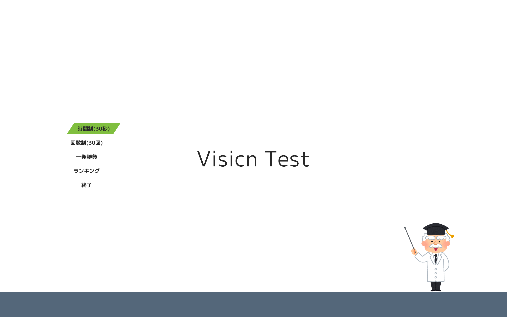
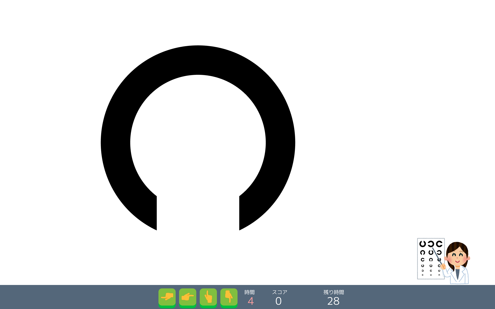

# Vision test
This is a game like vision test.
You can play vision test and enjoy.

SlideShare(Detail): [https://www.slideshare.net/TenTokoro/vision-test](https://www.slideshare.net/TenTokoro/vision-test)

## Getting Started

### Prerequisites
- [OpenSiv3D](https://siv3d.github.io/)
- IDE(e.g., Visual Studio, XCode, ...)

### Installing
1. Install OpenSiv3D on your environment according to [OpenSiv3D reference](https://scrapbox.io/Siv3D/OpenSiv3D%E3%83%AA%E3%83%95%E3%82%A1%E3%83%AC%E3%83%B3%E3%82%B9).
2. Create new project on your IDE.
3. Add `src/*` files to your project.
4. Build the project.
5. Copy `assets` directory to under the same directory as built program.

### Usage
Start the built program. Let's vision test.
